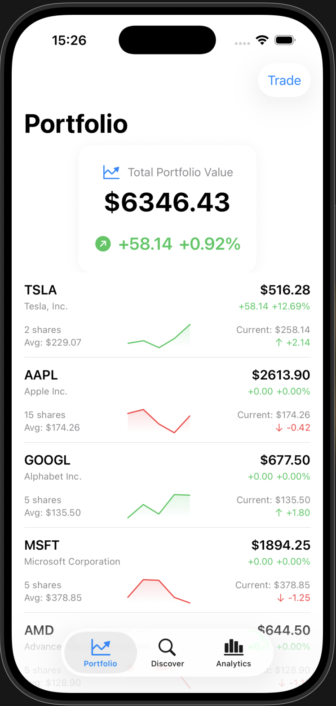
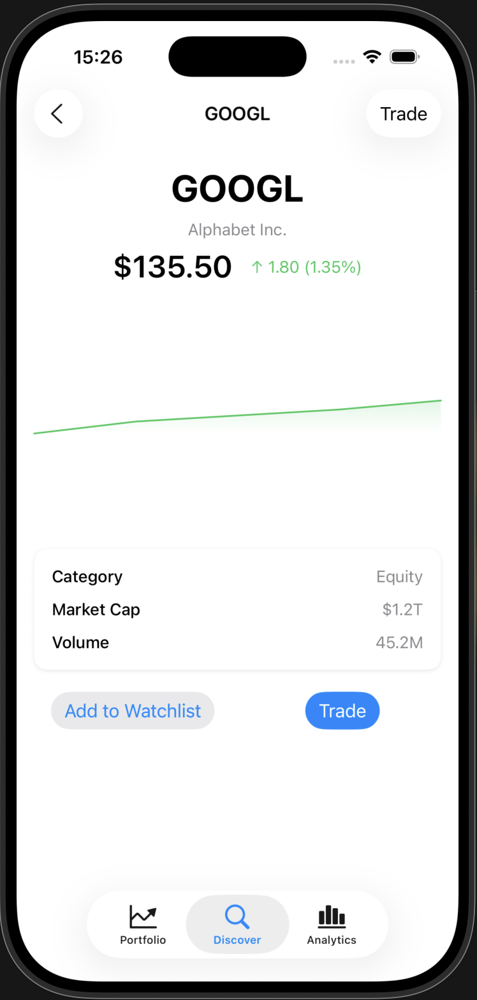
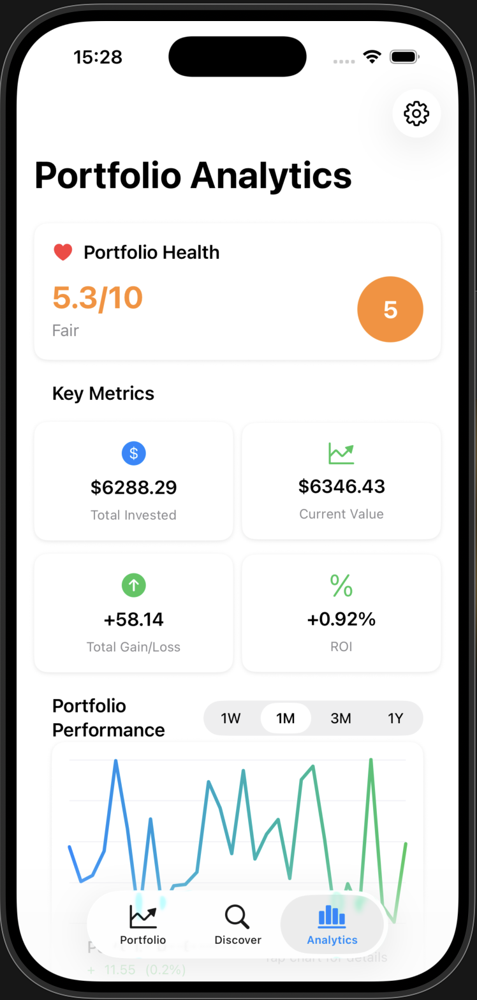

# StockPortfolio - iOS Stock Trading App

Hey there! This is a stock portfolio management app I built using SwiftUI. It's basically like having your own personal stock trading app where you can track your investments, buy and sell stocks, and see how your portfolio is performing.

## What does this app do?

Think of it as your personal finance tracker for stocks. You can:

- **Sign up and log in** to your account
- **View your portfolio** - see all the stocks you own and their current values
- **Buy and sell stocks** - just like a real trading app
- **Track your gains/losses** - see if you're making money or losing it
- **Search for stocks** - find new investment opportunities
- **Set price alerts** - get notified when stocks hit certain prices
- **Export your data** - download your transaction history

## How to run it

1. Make sure you have Xcode 15+ installed
2. Clone this repository
3. Open `StockPortfolio.xcodeproj` in Xcode
4. Hit the play button and run it on the simulator

**Test account:**
- Email: `test@stockport.com`
- Password: `Test@123`

## What's inside?

The app is built with:
- **SwiftUI** for the user interface (looks modern and clean)
- **MVVM pattern** to keep the code organized
- **Combine** for handling data updates
- **Local storage** so your data persists between app launches

## Key screens

- **Login/Signup** - Get into your account
- **Portfolio** - Your main dashboard showing all your stocks
- **Discover** - Search and find new stocks to invest in
- **Analytics** - Charts and insights about your portfolio performance
- **Settings** - Manage your account and export data

## Screenshots

### Portfolio View

*Your main dashboard showing total portfolio value and individual stock holdings*

### Discover & Search

*Search for stocks, view watchlist, and set price alerts*

### Analytics Dashboard

*Detailed analytics with performance charts and portfolio insights*

## Testing

I've included both unit tests and UI tests. You can run them in Xcode or use the command line:

```bash
# Run all tests
xcodebuild test -scheme StockPortfolio -destination 'platform=iOS Simulator,name=iPhone 15'
```

## Note

This app uses mock data for demonstration purposes. In a real app, you'd connect to actual stock market APIs to get live prices and execute real trades.

Built with ❤️ using SwiftUI
